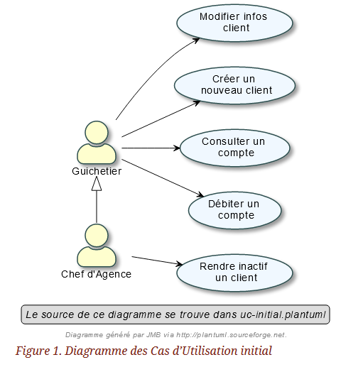

=  SAE 2.05    Groupe 2A04
Massip, Nabaoui, Quinveros <massip.romain@etu.univ-tlse2.fr><maisonaya@gmail.com><jordan.quinveros.pro@gmail.com>
v1.0, 2022-03-28

:toc: Creation d'un cahier des charges

== Creation d'un cahier des charges 
* [x] Réalisation du document Asciidoc 
* [*] Réalisation d'un Gantt

:toc: Objectif du projet

== Objectif du projet
* Ce projet est en 2 parties:
** La partie cahier des charges (préparer tout le projet avant la conception)
** La partie programmation et conception de l'application bancaire (DailyBank)

:toc: Analyse de l'existant
* Une application est déjà en place on l'appellera la V0. Elle contient déjà quelques fonctionnalités qui permette au guichetier de :
** Modifier informations client (adresse, téléphone, …)
** Creer un nouveau client
** Consulter un compte
** Débiter un compte (BD)

* Dans la version existante (V0), un chef d’agence peut :
** Rendre inactif un client

