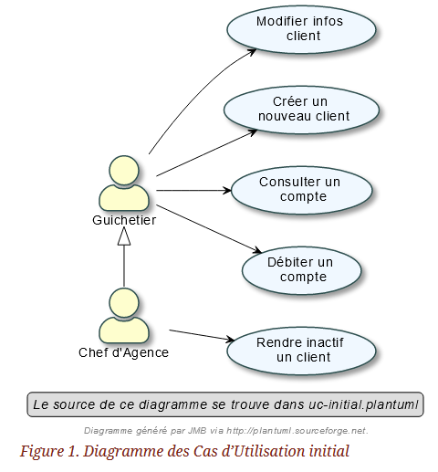
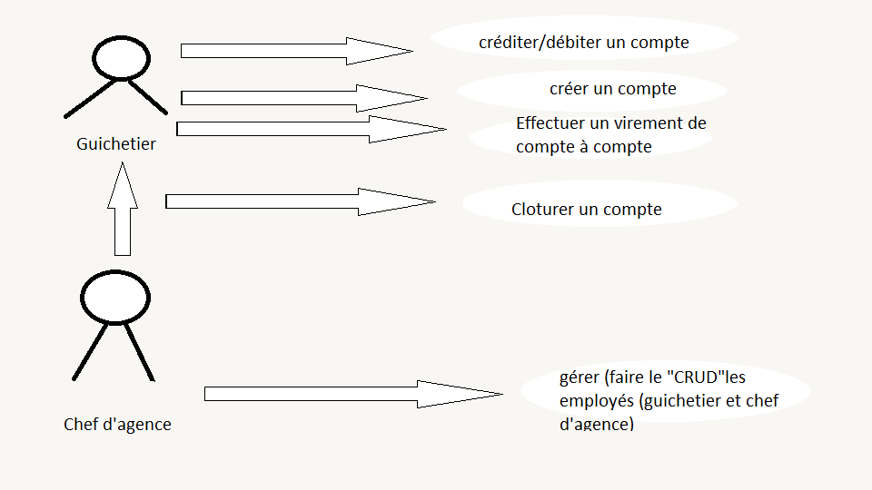

=  SAE 2.05    Groupe 2A04

Massip, Nabaoui, Quinveros<massip.romain@etu.univ-tlse2.fr, maisonaya@gmail.com, jordan.quinveros.pro@gmail.com>
v2.0, 2022-03-28

:toc:
:toc-title: Sommaire

[[id,Objectif du projet]]

== Objectif du projet

La banque DailyBank souhaite développer une application JAVA-Oracle de
gestion des comptes clients pour remplacer plusieurs outils obsolètes. 
Ce développement s’inscrit dans le cadre de la restructuration de ses 
services bancaires et l’application sera déployée dans les 100 agences 
que compte son réseau.

[[id5,Description du client]]
=== Description du client

Notre client s'agit de la Banque DailyBank qui est une des plus grande d'Antarctique. Créé en 1859, elle est aujourd'hui mondialement connue. Elle souhaite se modernisé pour offrir a ses clients un services plus rapide et connecté.
Ainsi DailyBank pourras faire utilisé notre application à tous ses clients.

[[id2,Analyse de l'existant]]
== Analyse de l'existant

Une application est déjà en place on l'appellera la V0. Elle contient déjà quelques fonctionnalités qui permette au guichetier de :
** Modifier informations client (adresse, téléphone, …)
** Creer un nouveau client
** Consulter un compte
** Débiter un compte (BD)

* Dans la version existante (V0), un chef d’agence peut :
** Rendre inactif un client

[[id3,Analyse des besoins]]
== Analyse des besoins 
Nous avons réalisé un use case pour la v0 :

[[id4,Analyse des contraintes : techniques et organisationnelles]]
== Analyse des contraintes : techniques et organisationnelles
Plusieurs *contraintes* se dessinent :

.Tableau des contraintes
[options="header",width="60%",align="center",cols="^,^"]
|====================================
|techniques       |Organisationnelles
|Quels sont les taches critiques, celle ou il ne faut pas prendre de retard
|Comment repartir equitablement le travail, et en fonction des points forts de chacun
|Avons nous tous les logiciels nécessaire pour la conception de l'application
|Avons nous tous les droits juridiques
|Il faut que l'application soit bien sécurisé car il s'agit d'une banques
|Avons nous accès au politiques de l'entreprise
|====================================

* Pour nous aider pour le cahier de test
https://www.dynamic-mess.com/developpement/creation-cahier-de-tests/
