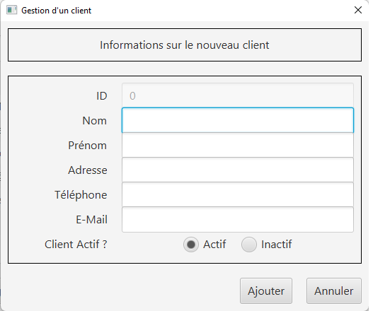

= Iut Blagnac

= Cahier de recettes pour l'application Daily Bank

=  SAE 2.05 / 2.01   Groupe 2A04

Massip, Nabaoui, Quinveros<massip.romain@etu.univ-tlse2.fr, maisonaya@gmail.com, jordan.quinveros.pro@gmail.com>
v1.0, 2022-06-08
== Fais par Jordan Quinveros, et Romain Massip

= Table des matières
<<id,Objectif du projet>>

<<id2,Partie Test>>

<<id3,Gestions des Clients>>

** <<id4,Cloturer Compte>>

** <<id5,Nouveau Compte>>

** <<id6,Débit/Crédit/Virement>>

** <<id7,Nouveau Client>>

** <<id8,Générer PDF>>

<<id9,Gestions des Employés>>

** <<id10,Modifier Employé>>

** <<id11,Nouveau Employé>>

** <<id12,Recherche Employé>>

[[id,Objectif du projet]]
== 1.Presentation du sujet
=== Objectif du projet

La banque DailyBank souhaite développer une application JAVA-Oracle de
gestion des comptes clients pour remplacer plusieurs outils obsolètes. 
Ce développement s’inscrit dans le cadre de la restructuration de ses 
services bancaires et l’application sera déployée dans les 100 agences 
que compte son réseau.

[[id2,Test]]
== 2.Test

[[id3,Gestions des Clients]]
=== A) Gestions des Clients

[[id4,Cloturer Compte]]
==== A.1) Cloturer Compte

|====================================
|id Test |nom Test | Nom cas d’utilisation |Conditions de satisfaction |Préconditions
| A1 | Test Cloturer un compte | Cloturer un compte  | Pour pouvoir cloturer un compte d'un client. Ne peut être réouvert si il est cloturer | Compte déja existant et non cloturer. Compte avec solde à 0.
|====================================

Test réaliser avec succès. La cloturation d'un compte fonctionne parafaitement.

[[id5,Nouveau Compte]]
==== A.2) Nouveau Compte

|====================================
|id Test |nom Test | Nom cas d’utilisation |Conditions de satisfaction |Préconditions
| A1 | Test Nouveau Compte | Nouveau Compte  | Pour pouvoir créer un compte d'un client. Avec un id unique| Aucun compte avec le même id. Client déjà créer. Compte avec solde supérieur à 50€ et découvert ne pouvant être possitif.
|====================================

Test réaliser avec succès. La création d'un nouveau compte fonctionne parafaitement.

[[id6,Débit/Crédit/Virement]]
==== A.3) Débit/Crédit/Virement

|====================================
|id Test |nom Test | Nom cas d’utilisation |Conditions de satisfaction |Préconditions
| A1 | Test Débit/Crédit/Virement | Débit/Crédit/Virement  | Pour pouvoir cloturer un compte d'un client. Ne peut être réouvert si il est cloturer | Compte déja existant et non cloturer. Compte avec solde à 0.
|====================================

Test réaliser avec succès. Les débits/ crédits/ virement sur un compte fonctionne parafaitement.

==== Débit :

==== Crédit :

==== Virement :

[[id7,Nouveau Client]]
==== A.4) Nouveau Client, Modifier

|====================================
|id Test |nom Test | Nom cas d’utilisation |Conditions de satisfaction |Préconditions
| A1 | Test Nouveau Client, Modifier | Nouveau Client, Modifier  | Pour pouvoir créer un client ou le modifier. | Client ne pouvant avoir le même id qu'un autre. Peut avoir le même nom et prénom. Adresse mail valide (@), numéros de téléphone avec 10 chiffres.
|====================================

Test réaliser avec succès. La création d'un nouveau  / modification d 'un client fonctionne parafaitement.
==== Création d'un client

==== Modification d'un client

[[id8,Générer PDF]]
==== A.5) Générer PDF

|====================================
|id Test |nom Test | Nom cas d’utilisation |Conditions de satisfaction |Préconditions
| A1 | Test Générer PDF | Générer PDF  | Pour pouvoir générer un pdf d'un compte en fonction du mois. Ne peut être générer que si il y a des transaction durant un mois donnés | Avoir un compte, ainsi que des transactions dans un mois (ex impossible d'imprimer le relevé de janvier si le compte est ouvert en mars)
|====================================

Test réaliser avec succès. La génération d'un PDF mensuel fonctionne parafaitement.
==== Comment générer le pdf

==== Apercu du pdf

[[id9,Gestions des Employés]]
=== B) Gestions des Employés

[[id10,Modifier Employé]]
==== B.1) Modifier Employé

|====================================
|id Test |nom Test | Nom cas d’utilisation |Conditions de satisfaction |Préconditions
| A1 | Test Modifier Employé | Modifier Employé  | Pour pouvoir modifier les renseignements d'un employé.| Nécessite que l'Employé soit déjà créer. Impossible de modifier l'id.
|====================================

Test réaliser avec succès. La modification d'un employé fonctionne parafaitement.
==== Fenêtre de modification d'employé
image::Image/Cahier_recette/modifemploye.png[width=50%]

[[id11,Nouveau Employé]]
==== B.2) Nouveau Employé

|====================================
|id Test |nom Test | Nom cas d’utilisation |Conditions de satisfaction |Préconditions
| A1 | Test Nouveau Employé | Nouveau Employé  | Pour pouvoir créer les renseignements d'un employé. | Nécessite que l'Employé n'est pas l'id d'un autre. Ne peut contenir un champs vide.
|====================================

Test réaliser avec succès. La création d'un employé fonctionne parafaitement.

image::Image/Cahier_recette/creationemploye.png[width=50%]

[[id12,Recherche Employé]]
==== B.3) Recherche Employé

|====================================
|id Test |nom Test | Nom cas d’utilisation |Conditions de satisfaction |Préconditions
| A1 | Test Recherche Employé | Recherche Employé  | Pour pouvoir rechercher un employé.| Nécessite que l'employé existe, et de connaitre son login.
|====================================

Test réaliser avec succès. La recherche d'un employé fonctionne parafaitement.

image::Image/Cahier_recette/rechercheemploye.png[width=50%]
==== Recherche en temps réel, à chaque lettres ajoutés.

