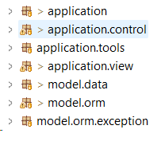
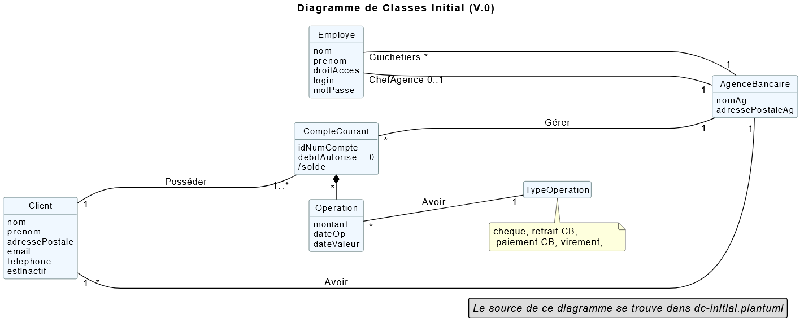
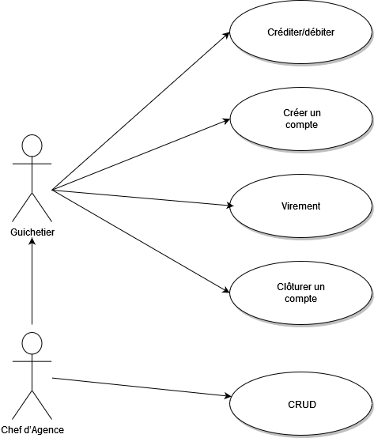
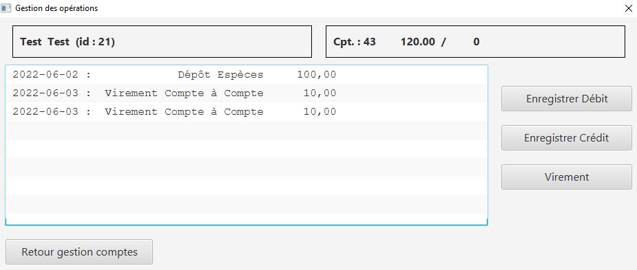
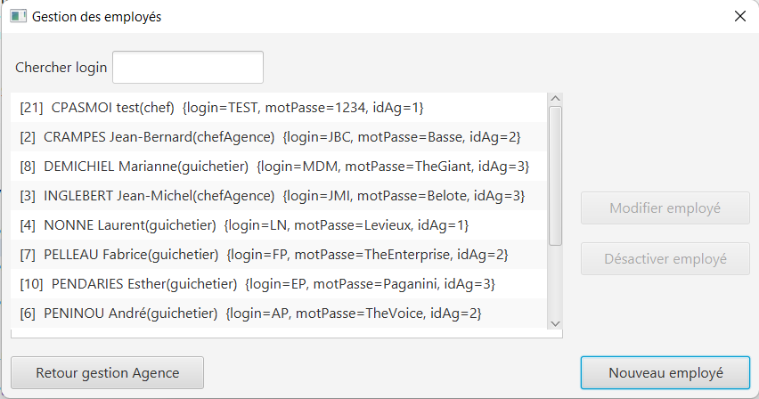

= Iut Blagnac

= Documentation Technique

=  SAE 2.05 / 2.01   Groupe 2A04

Massip, Nabaoui, Quinveros<massip.romain@etu.univ-tlse2.fr, maisonaya@gmail.com, jordan.quinveros.pro@gmail.com>
v1.0, 2022-05-17

= Information
[options="header",width="60%",align="center",cols="^,^"]
|====================================
|Nom du projet |Daily Bank
|Type de document |Documentation technique
|Date |03/06/2022
|Version | 1.0
|Mots-clés | Technologies, Developpement, Gestion
|Auteurs | Aya Nabaoui, Romain Massip, Jordan Quinveros
|====================================

== Sommaire

=== 1.Présentation du sujet

<<id,Objectif du projet>>

<<id2,Architecture de l'application>>

=== 2.Presentation des différentes versions 

<<id3,Présentation de la V0>>

[[id,Objectif du projet]]

== 1.Presentation du sujet
=== Objectif du projet

La banque DailyBank souhaite développer une application JAVA-Oracle de
gestion des comptes clients pour remplacer plusieurs outils obsolètes. 
Ce développement s’inscrit dans le cadre de la restructuration de ses 
services bancaires et l’application sera déployée dans les 100 agences 
que compte son réseau.

=== Application attendu

Rajouter des fonctionnalité à l’application que nous avons reçu, par exemple: 

   Le Guichetier puisse:

**    Créditer/débiter un compte (java et BD avec procédure stockée)
**    Créer un compte
**    Effectuer un virement de compte à compte
**    Clôturer un compte        
**    Générer un relevé mensuel d’un compte en PDF
**    Gérer (faire le « CRUD[2] ») les prélèvements automatiques
**    Modifier informations client (adresse, téléphone, …)
**    Créer un nouveau client
**    Consulter un compte
**    Débiter un compte (BD)

    Le Chef d’Agence puisse:

**    Gérer (faire le « CRUD ») les employés (guichetier et chef d’agence)
**    Effectuer un Débit exceptionnel
**    Simuler un emprunt
**    Simuler une assurance d’emprunt
**   Rendre inactif un client

Ainsi que d’autre fonctionnalité que nous mettrons si le temps nous le permet.

[[id2,Architecture de l'application]]
== Architecture de l'application

Notre application à été écrite en java avec la bibliothèque de javaFX 1.8 qui nous a permis de créer l'interface graphique de l'application, ainsi qu'une base de donnée en SQL oracle qui nous permet de stocker tous les clients de la banques, leurs comptes, leurs transactions, les employés. Nous avons choisi SQL oracle car il est simple d'utilisation.

image::Image/LogoJAVAFX.png[width=10%]
image::Image/LogoSql.png[width=10%]

Nous avons créer un .jar permettant d'executer l'application sur un pc.

Plusieurs packages sont diponibles dans notre application, chaqu'un joue un role important, une certaine hiérarchie est instauré.

Application.view :: regroupe les fichiers fxml ainsi que leur différents controllers. 
Application.tools :: est un package contenant les outils d'alertes, des constantes reutillisables.
Application.control :: permet de gérer les différents fenêtre créer dans le package view.
Application :: permet de lancer les différentes méthodes pour initialiser le lancement de l'application

Model.data :: regroupe tous les différents acteurs qui peuvent interagir et qui sont stocké dans la base de donnés, ainsi que leur different constructeur
Par exemple les clients, les employés.

Model.orm :: permet de gérer les différents actions qu'on peut réaliser depuis l'application comme le CRUD.

Model.orm.exception :: lève toutes les exceptions rencontrées dans l'application

== 2.Presentation des différentes versions 

[[id3,Présentation de la V0]]
=== Présentation de la V0
image::Image/usecaseV0.png[align="center", width=40%]

Dans la version existante (V0), un guichetier peut :

    ** Modifier informations client (adresse, téléphone, …)

   ** Créer un nouveau client

  **  Consulter un compte

  **  Débiter un compte (BD)

Dans la version existante (V0), un chef d’agence peut :

 **   Rendre inactif un client
 
 
Liste des fonctionnalités développées :
  
Fontionnalité faite par : Romain Massip
 
** Crédit 
 
** Virement
 
Fontionnalité faite par : Aya Nabaoui
 
** Créer un compte 
 
Fontionnalité faite par : Jordan Quinveros
 
** CLoturer un compte
 
 package CompteManagementController
 
** Gerer les employés (le CRUD)

=== V1

=== Créditer:

C'est sur cette interface que l'opération créditer et disponible.
Quand vous clicker sur enregistrer crédit ,Vous activerlaméthode **doCrédit** qui vas enregistrer un Crédit de la méthode **enregistrerCredit** ,qui ensuite vas ouvrir la fenetre pour faire le crédit et vas paramétrer la page en fonction de qul action et choisie en passent par **doOperationEditorDialog** puis **displayDialog** puis si l'Opération n'est pas null il vas créer un **accessOperation** et faire un insert ,méthode **insertCredit** dans la base de données pour cela il vas appeler la procedure de la base de données créditee.Et enfin il vas remonter l'Opération et dans **doCredit** il vas mettre à jour l'affichage dans l'application.

=== Gérer les employés :
Application.view :: 
** Classe : **EmployeEditorPaneController** 
*** **doAjouter** (Méthode) Appelé par **empoyeeditorpane.fxml**
** Classe : **EmployeManagementController**
*** **doRechercher** Appelé par **empoyemanagement.fxml**
*** **doModifierEmploye** Appelé par **empoyemanagement.fxml**
*** **doNouveauEmploye** Appelé par **empoyemanagement.fxml**
Application.tools :: 
Application.control :: 
** Classe : **EmployesManagement**. **EmployesManagement** qui permet de paramétrer la fenêtre des employés. 

*** **modifierEmploye** (Méthode) => **EmployeManagementController** (Classe qui l'appele). 
*** **nouveauEmployé** (Méthode) => **EmployeEditorPaneController** (Classe qui l'appele).
*** **getListeEmployé** (Méthode) => **EmployeManagementController** (Classe qui l'appele).

** Classe : **EmployeEditorPane** Permet l'ouverture de la fenêtre pour modifier un employé elle est appelé dans la classe: 
*** **EmployeEditorPane** (Méthode) => **EmployesManagement** (Classe qui l'appele) => **EmployeManagementController** (Classe qui l'appele) 

Application :: 
Model.data :: 
** Classe : **Employé** Classe qui définit les attributs d'un employé

Model.orm :: permet de gérer les différents actions qu'on peut réaliser depuis l'application comme le CRUD.

Model.orm.exception :: lève toutes les exceptions rencontrées dans l'application

