= Iut Blagnac

=  SAE 2.05 / 2.01   Groupe 2A04

Massip, Nabaoui, Quinveros<massip.romain@etu.univ-tlse2.fr, maisonaya@gmail.com, jordan.quinveros.pro@gmail.com>
v1.0, 2022-06-08

== Sommaire
<<id,Presentation générale>>

<<id2,Installation utilisation >>

<<id3,Fonctionnement>>

<<id4, Utilisation>>

== 1.Presentation générale
La banque DailyBank souhaite développer une application JAVA-Oracle de gestion des comptes clients pour remplacer plusieurs outils obsolètes. Ce développement s’inscrit dans le cadre de la restructuration de ses services bancaires et l’application sera déployée dans les 100 agences que compte son réseau. 

== 2.Installation utilisation 
Pour commencer l'installation de l'application, on commence par télécharger le jar.Puis le projet démarre en lançant le jar depuis l'invite de commande(CMD).Pour cela il faut avoir la bonne version de java,pour cela exécuté la commande **java -version** , la version doit être la 8 si ce n'est pas le cas télécharger la version 8 de java.Puis quand cela est fait executer la commande **java -jar <nom du fichier jar>** et L'application devrait se lancer

== 3.Fonctionnement
Quand le projet démarre. L'application permet à un guichetier de creer un nouveau client et modifie ses informations et de consulter et débiter un compte,de faire des virements de compte à compte ainsi que Clôturer un compte. Elle permet un chef d'agence de rendre inactif un client,de consulter la liste de employer, d'en créer, d'en supprimer, d'en modifier.

== 4. Utilisation
Voici un guide d'utilisation de l'application:

=== 4.1. A l'ouverture de l'application ,Vous arrivez sur cette page:

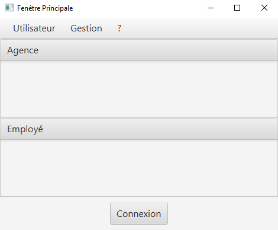

Sur cette page Deux actions peuvent être affectuer

Quitter l'application:

** Depuis la crois en haut a droite
** Depuis Utisateur → Quitter

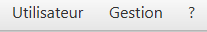

Se connecter:

** Depuis Utisateur → Connection
** Depuis le bouton Connection

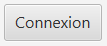

=== 4.2. Quand vous vous connectez une interface de connection apparé :

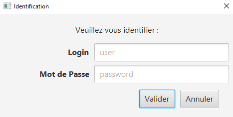

Rentrez vos identifiant et mot de passe de connection

=== 4.3. Quand vous êtes connectés :

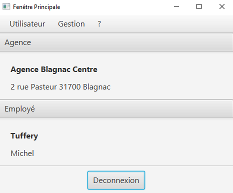

Sur cette page de nouvelle fonctionnalité sont disponibles:

Se Déconnecter:

** Utilisateur → Déconnection
** Bouton déconnecter

Accéder aux interface Client et Employer:

** Gestion → Employés
** Gestion → Clients

Accédons à l'interface Clients

=== 4.4. Interface Clients

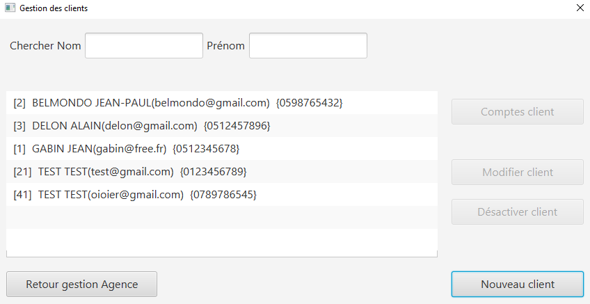

Sur cette page 3 fonctionalitées sont disponibles:

** Quitter l'interface Client

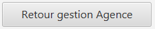

** Créer un client

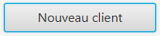

Se qui ouvre l'interface de création de client

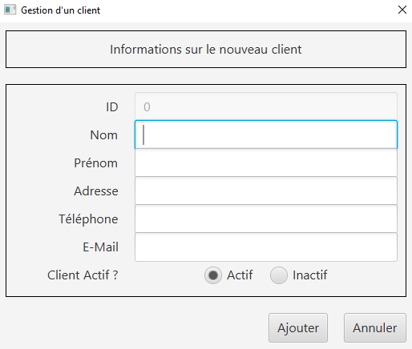

** Rechercher les clients de l'Agence

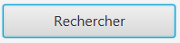

=== 4.5. Suite à cette action L'application affiche les clients:

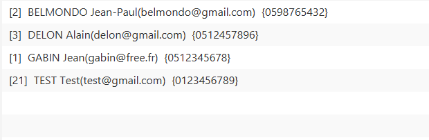

Sélectionné un compte et deux boutons deviennent disponibles

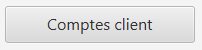

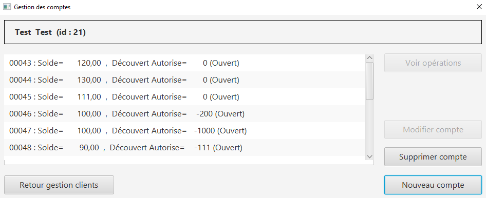

** Se bouton permet d'ouvrir l'interface de gestion des comptes du client sélectionné

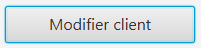

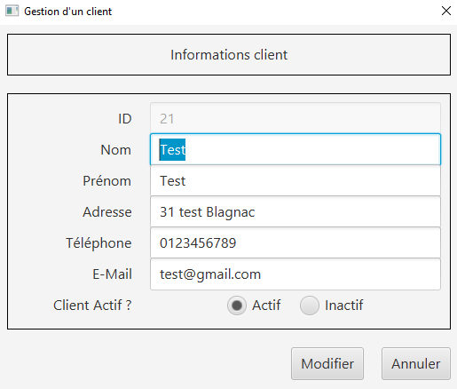

** Se bouton permet de modifier les informations du client

** Créer un compte

Pour créer un nouveau compte nous allons avoir besoin de l'interface Nouveau client.

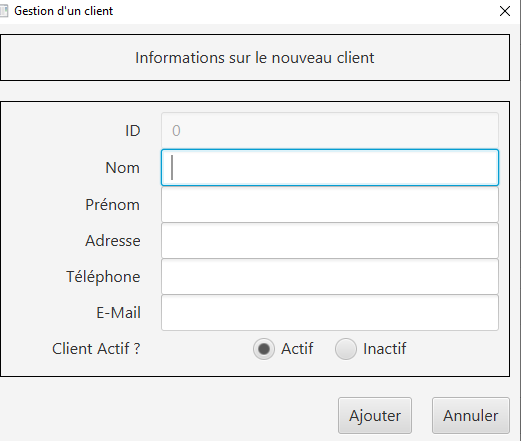

Cette interface permet de remplir les iformations du clients nécessaire pour lui créer son compte , il doit renseigner son nom,prénom,adresse,son numéro de télephone et son e-mail. On peut également rendre le client actif ou inactif en cliquant sur le boutuon que l'on souhaite. Pour confirmer la création du nouveau compte client ,on clique sur le bouton Ajouter pour créer le compte.

=== 4.6. Interface Compte Clients

Sur cette interface il faut sélectionné un compte

Quand vous avez sélectionnés un compte, Vous avez accés à plusieurs fonctionnalité :

 ** Voir les opérations liée au compte sélectionné
 
 image::Image/DocUtilisateur/BoutonVO.PNG[width=20%]

** Cloturer le compte

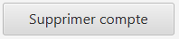

** Créer un compte

Lorsqu'on selectionne un compte et qu'on clique sur le bouton Comptes client une fenetre gestion des comptes s'ouvre ou apparait le solde le découvert Autorise du client selectionné.

Pour créer le nouveau compte , on appuie sur le bouton nouveau compte qui nous redirige vers une nouvelle fenetre ou s'affiche les informations sur le nouveau compte. On choisit le solde que l'on souhaite ajouter ansi que le découvert que l'on souhaite, les autres informations tel que l'ID client, ID agence et nuuméro de compte sont automatiquement génerer par la base de donnée.

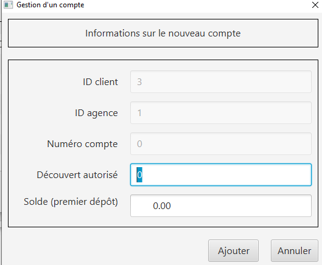

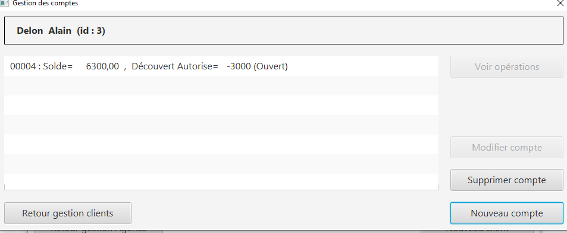

