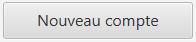
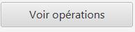
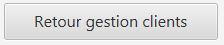
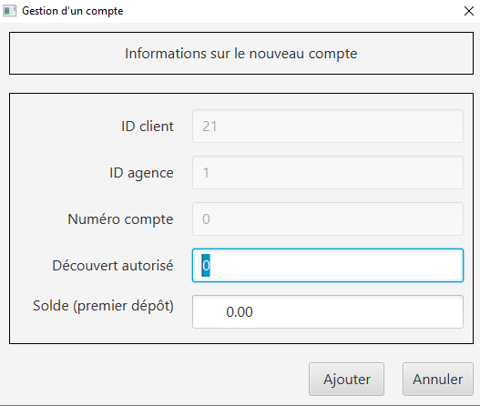
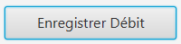
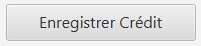
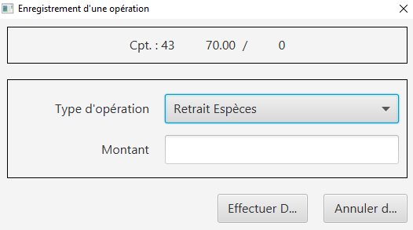
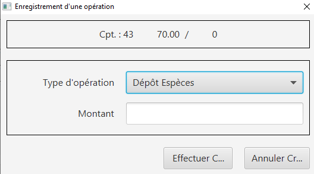
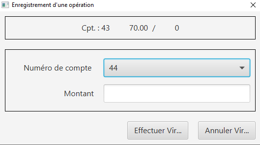

= Iut Blagnac

=  SAE 2.05 / 2.01   Groupe 2A04

Massip, Nabaoui, Quinveros<massip.romain@etu.univ-tlse2.fr, maisonaya@gmail.com, jordan.quinveros.pro@gmail.com>
v1.0, 2022-06-08

== Sommaire
<<id,Presentation générale>>

<<id2,Installation utilisation >>

<<id3,Fonctionnement>>

<<id4, Utilisation>>

== 1.Presentation générale
La banque DailyBank souhaite développer une application JAVA-Oracle de gestion des comptes clients pour remplacer plusieurs outils obsolètes. Ce développement s’inscrit dans le cadre de la restructuration de ses services bancaires et l’application sera déployée dans les 100 agences que compte son réseau. 

== 2.Installation utilisation 
Pour commencer l'installation de l'application, on commence par télécharger le jar.Puis le projet démarre en lançant le jar depuis l'invite de commande(CMD).Pour cela il faut avoir la bonne version de java,pour cela exécuté la commande **java -version** , la version doit être la 8 si ce n'est pas le cas télécharger la version 8 de java.Puis quand cela est fait executer la commande **java -jar <nom du fichier jar>** et L'application devrait se lancer

== 3.Fonctionnement
Quand le projet démarre. L'application permet à un guichetier de creer un nouveau client et modifie ses informations et de consulter et débiter un compte,de faire des virements de compte à compte ainsi que Clôturer un compte. Elle permet un chef d'agence de rendre inactif un client,de consulter la liste de employer, d'en créer, d'en supprimer, d'en modifier.

== 4. Utilisation
Voici un guide d'utilisation de l'application:

=== 4.1. Interface d'Arriver:

A l'ouverture de l'application ,Vous arrivez sur cette page:

image::Image/DocUtilisateur/InterfaceArrive.PNG[width=30%]

Sur cette page Deux actions peuvent être affectuer:

image::Image/DocUtilisateur/BarreUtilisateurGestion.PNG[width=30%]

**Quitter l'application:**

*** Depuis la crois en haut a droite
*** Depuis Utisateur → Quitter

**Se connecter:**

*** Depuis Utisateur → Connection
*** Depuis le bouton Connection

image::Image/DocUtilisateur/BoutonConnection.PNG[width=10%]

=== 4.2. Interface de Connection:

image::Image/DocUtilisateur/Interface connection.PNG[width=40%]

Rentrez vos identifiant et mot de passe de connection

=== 4.3. Interface d'Arriver Connecté :

image::Image/DocUtilisateur/InterfaceConnecter.PNG[width=40%]

Sur cette page de nouvelle fonctionnalité sont disponibles:

image::Image/DocUtilisateur/BarreUtilisateurGestion.PNG[width=30%]

**Se Déconnecter:**

*** Utilisateur → Déconnection
*** Bouton déconnecter

**Accéder aux interface Client et Employer:**

*** Gestion → Employés
*** Gestion → Clients

=== 4.4. Interface Clients

image::Image/DocUtilisateur/InterfaceGC.PNG[width=30%]

Sur cette page 3 fonctionalitées sont disponibles:

**Quitter l'interface Client**

image::Image/DocUtilisateur/CaptureRA.PNG[width=20%]

**Créer un client**

image::Image/DocUtilisateur/BoutonNC.PNG[width=20%]

*** Se qui ouvre l'interface de création de client 

**Rechercher les clients de l'Agence**

image::Image/DocUtilisateur/BoutonR.PNG[width=20%]

*** Permet de recherché et d'afficher tout les clients de l'agence.

**Suite à cette action L'application affiche les clients:**

image::Image/DocUtilisateur/AffichageC.PNG[width=50%]

**Sélectionné un compte et deux boutons deviennent disponibles**

**Compte Client**

image::Image/DocUtilisateur/BoutonCC.PNG[width=0%]

*** Vas ouvrir l'interface avec tout les comptes du client sélectionné.

**Modifier un Client**

image::Image/DocUtilisateur/AffichageC.PNG[width=50%]

*** Vas ouvrir une interface avec les informations présente pour les modifiers.

=== 4.5. Interface Création Client

image::Image/DocUtilisateur/InterfaceNC.PNG[width=50%]

Cette interface permet de créer un Client

*** Pour cela il faut remplir tout les champs.

=== 4.6. Modifier Client

image::Image/DocUtilisateur/InterfaceMC.PNG[width=50%]

Cette interface permet de modifer les informations d'un client.

=== 4.7. Compte d'un Client

image::Image/DocUtilisateur/InterfaceCC.PNG[width=50%]

Cette interface permet devoir les comptes du client sélectionné.

Dans cette interface on peut faire:

**Nouveau Compte**

*** Ouvre l'interface de Création de Compte.

**Supprimer Compte**

image::Image/DocUtilisateur/BoutonSC.PNG[width=20%]

***Cloture le compte si le solde est a 0.

**Voir Opération**

***Permet d'ouvrir l'interface pour voir et faire des opération sur le compte sélectionné.

**Retour**

*** Permet de revenir a l'interface de gestion des clients.

=== 4.8. interface Nouveau Compte

Interface de création du compte pour le client sélectionnné précédament.

=== 4.9. Inteface Des Opérations

image::Image/DocUtilisateur/InterfaceVO.PNG[width=50%]

Interface qui permet de voir les Opération déjà effectué mais aussi d'en faire

Pour cela 3 fonctionnalité sont disponible:

**Enregistrer Débit**

*** Ouvre l'interface pour effectué un retrait.

**Enregistrer Crédit**

*** Ouvre l'interface pour effectué un dépot.

**Enregistrer Virement**

image::Image/DocUtilisateur/BoutonEngV.PNG[width=20%]

*** Ouvre l'interface pour effectué un virement a un compte du meme client.

**Retour**

=== 4.10. Interface Débit

Interface ou on peut choisir le montant a retirer.

=== 4.11. Interface Crédit

Interface ou on peut choisir le montant a Créditer.

=== 4.12. Interface Virement

Interface ou on peut choisir le montant a Transférer a un autre client. 

