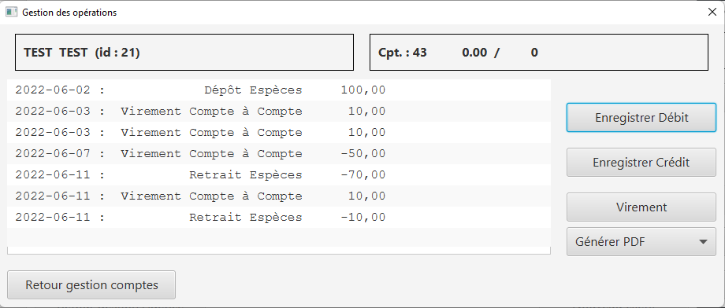
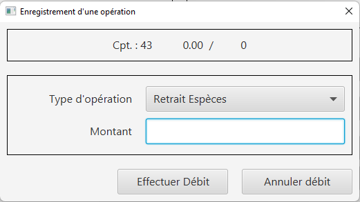
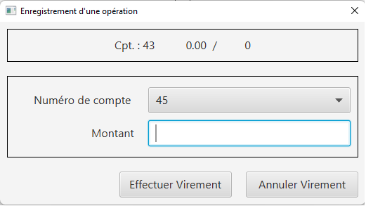
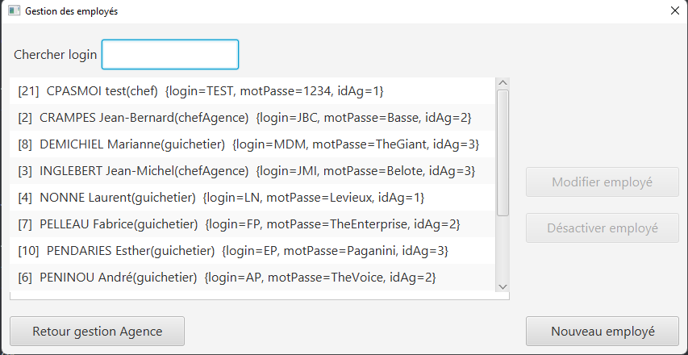
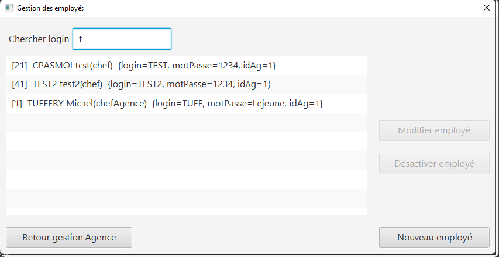
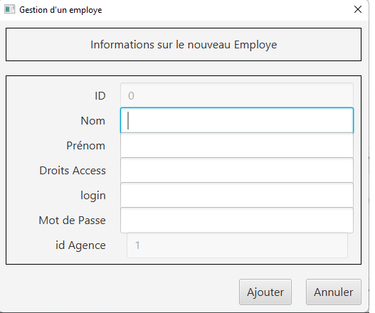
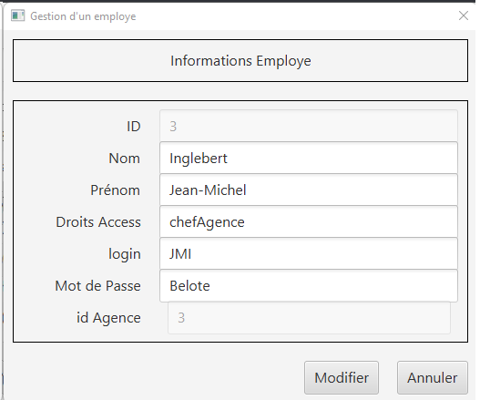

= Iut Blagnac

= Documentation Utilisateur de l'application Daily Bank

=  SAE 2.05 / 2.01   Groupe 2A04

Massip, Nabaoui, Quinveros<massip.romain@etu.univ-tlse2.fr, maisonaya@gmail.com, jordan.quinveros.pro@gmail.com>
v1.0, 2022-06-08

== Sommaire
<<id,Presentation générale>>

<<id2,Installation utilisation >>

<<id3,Fonctionnement>>

<<id4, Utilisation>>

** <<id5,4.1 Interface d'Arriver>>
** <<id6,4.2 Interface de Connection>>
** <<id7,4.3 Interface d'Arriver Connecté>>
** <<id8,4.4 Interface Clients>>
** <<id9,4.5 Interface Création Client>>
** <<id10,4.6 Modifier Client>>
** <<id11,4.7 Compte d'un Client>>
** <<id12,4.8 interface Nouveau Compte>>
** <<id13,4.9 Inteface Des Opérations>>
** <<id14,4.10 Interface débit>>
** <<id15,4.11 Interface Crédit>>
** <<id16,4.12 Interface Virement>>

<<id17,Interface Employé>>

** <<id18,Interface d'arrivé d'Employé>>
** <<id19,Création d'un employé>>
** <<id20,Modification d'un employé>>

[[id,Presentation générale]]

== 1.Presentation générale
La banque DailyBank souhaite développer une application JAVA-Oracle de gestion des comptes clients pour remplacer plusieurs outils obsolètes. Ce développement s’inscrit dans le cadre de la restructuration de ses services bancaires et l’application sera déployée dans les 100 agences que compte son réseau. 

[[id2,Installation utilisation]]

== 2.Installation utilisation 
Pour commencer l'installation de l'application, on commence par télécharger le jar.Puis le projet démarre en lançant le jar depuis l'invite de commande(CMD).Pour cela il faut avoir la bonne version de java,pour cela exécuté la commande **java -version** , la version doit être la 8 si ce n'est pas le cas télécharger la version 8 de java.Puis quand cela est fait executer la commande **java -jar <nom du fichier jar>** et L'application devrait se lancer

[[id3,Fonctionnement]]

== 3.Fonctionnement
Quand le projet démarre. L'application permet à un guichetier de creer un nouveau client et modifie ses informations et de consulter et débiter un compte,de faire des virements de compte à compte ainsi que Clôturer un compte. Elle permet un chef d'agence de rendre inactif un client,de consulter la liste de employer, d'en créer, d'en supprimer, d'en modifier.

[[id4,Utilisation]]
== 4. Utilisation
Voici un guide d'utilisation de l'application:

[[id5,Interface d'Arriver]]
=== 4.1. Interface d'Arriver:

A l'ouverture de l'application ,Vous arrivez sur cette page:

image::Image/DocUtilisateur/InterfaceArrive.PNG[width=50%]

Sur cette page Deux actions peuvent être affectuer:

image::Image/DocUtilisateur/BarreUtilisateurGestion.PNG[width=30%]

**Quitter l'application:**

*** Depuis la crois en haut a droite
*** Depuis Utisateur → Quitter

**Se connecter:**

*** Depuis Utisateur → Connection
*** Depuis le bouton Connection

image::Image/DocUtilisateur/BoutonConnection.PNG[width=20%]

[[id6,Interface de Connection]]

=== 4.2. Interface de Connection:

image::Image/DocUtilisateur/Interface connection.PNG[width=50%]

Rentrez vos identifiant et mot de passe de connection

[[id7,Interface d'Arriver Connecté]]

=== 4.3. Interface d'Arriver Connecté :

image::Image/DocUtilisateur/InterfaceConnecter.PNG[width=50%]

Sur cette page de nouvelle fonctionnalité sont disponibles:

image::Image/DocUtilisateur/BarreUtilisateurGestion.PNG[width=30%]

**Se Déconnecter:**

*** Utilisateur → Déconnection
*** Bouton déconnecter

**Accéder aux interface Client et Employer:**

*** Gestion → Employés
*** Gestion → Clients

[[id8,Interface Clients]]

=== 4.4. Interface Clients 

image::Image/DocUtilisateur/InterfaceGC.PNG[width=50%]

Sur cette page plusieurs fonctionalitées sont disponibles:

**Quitter l'interface Client**

image::Image/DocUtilisateur/CaptureRA.PNG[width=20%]

**Créer un client**

image::Image/DocUtilisateur/BoutonNC.PNG[width=20%]

*** Se qui ouvre l'interface de création de client 

**Sélectionné un compte et deux boutons deviennent disponibles :**

**Compte Client**

image::Image/DocUtilisateur/BoutonCC.PNG[width=20%]

*** Vas ouvrir l'interface avec tout les comptes du client sélectionné.

**Modifier un Client**

image::Image/DocUtilisateur/BoutonMC.PNG[width=20%]

*** Vas ouvrir une interface avec les informations présente pour les modifiers.

[[id9,Interface Création Client]]

=== 4.5. Interface Création Client

image::Image/DocUtilisateur/InterfaceNC.PNG[width=50%]

Cette interface permet de créer un Client

*** Pour cela il faut remplir tout les champs.

[[id10,Modifier Client]]

=== 4.6. Modifier Client

image::Image/DocUtilisateur/InterfaceMC.PNG[width=50%]

Cette interface permet de modifer les informations d'un client.

[[id11,Compte d'un Client]]

=== 4.7. Compte d'un Client

image::Image/DocUtilisateur/InterfaceCC.PNG[width=50%]

Cette interface permet devoir les comptes du client sélectionné.

Dans cette interface on peut faire:

**Nouveau Compte**

image::Image/DocUtilisateur/BoutonNCP.PNG[width=20%]

*** Ouvre l'interface de Création de Compte.

**Supprimer Compte**

image::Image/DocUtilisateur/BoutonSC.PNG[width=20%]

*** Cloture le compte si le solde est a 0.

**Voir Opération**

image::Image/DocUtilisateur/BoutonVO.PNG[width=20%]

*** Permet d'ouvrir l'interface pour voir et faire des opération sur le compte sélectionné.

**Retour**

image::Image/DocUtilisateur/BoutonRGC.PNG[width=20%]

*** Permet de revenir a l'interface de gestion des clients. 

[[id12,interface Nouveau Compte]]

=== 4.8. interface Nouveau Compte

image::Image/DocUtilisateur/InterfaceNCP.PNG[width=50%]

Interface de création du compte pour le client sélectionnné précédament.

[[id13,Inteface Des Opérations]]

=== 4.9. Inteface Des Opérations

Interface qui permet de voir les Opération déjà effectué mais aussi d'en faire

Pour cela 3 fonctionnalité sont disponible:

**Enregistrer Débit**

image::Image/DocUtilisateur/BoutonEngD.PNG[width=20%]

*** Ouvre l'interface pour effectué un retrait.

**Enregistrer Crédit**

image::Image/DocUtilisateur/BoutonEngC.PNG[width=20%]

*** Ouvre l'interface pour effectué un dépot.

**Enregistrer Virement**

image::Image/DocUtilisateur/BoutonEngV.PNG[width=20%]

*** Ouvre l'interface pour effectué un virement a un compte du meme client.

**Retour**

image::Image/DocUtilisateur/BoutonRGCP.PNG[width=20%]

[[id14,Interface Débit]]

=== 4.10. Interface Débit

Interface ou on peut choisir le montant a retirer.

[[id15,Interface Crédit]]

=== 4.11. Interface Crédit

Interface ou on peut choisir le montant a Créditer.

[[id16,Interface Virement]]

=== 4.12. Interface Virement

Interface ou on peut choisir le montant a Transférer a un autre client. 

[[id17,Interface Employé]]

== 5. Interface Employé

Une fois l'application lancé, il faut se connecter en temps que Chef d'agence pour pouvoir accéder à la page permettant la gestion des employés. Si vous êtes un chef d'agence, veuillez suivre pas à pas le guide, si vous n'êtes pas chef d'agence cette partie n'est malheureusement pas pour vous.

image::Image/DocUtilisateur/Jordan/menubaremployé.png[width=30%]

En haut à gauche ce trouve le menu, cliquez sur gestion puis emmployés. Si Employés n'est pas cliquable, c'est que vous n'êtes toujours pas chef d'agence.

[[id18,Interface d'arrivé d'Employé]]

=== 5.1 Interface d'arrivé d'Employé

Bienvenue sur l'interface, il est facile d'utilisation. Pour faire une recherche d'un employé, tapez la première lettre du login dans la barre de recherche en haut à gauche, la liste des employés ce mettra automatiquement à jour à chaque fois que vous rajouterez une lettre

[[id19,Création d'un employé]]

=== 5.2 Création d'un employé

Pour ce faire rien de bien compliqué. Cliquez sur le boutton "Nouveau Employé" en bas à droite de la fenêtre. Un pop-up devrait apparaitre, celui-ci :

Pour valider la création d'un employé il faut remplir tous les champs. Une fois les champs bien rempli, appuyez sur ajouter, si le boutton annuler supprimera les informations que vous avez mises et fermera la fenêtre.

[[id20,Modification d'un employé]]

=== 5.3 Modification d'un employé

Pour modifier un employé, il faut selectionner lequel on souhaite changer puis cliquer sur le boutton sur la droite de la fenêtre "Modifier employé"

Toutes les données de l'employé sont dans les différentes cases, veuillez changer celle que vous souhaitez sans la laissez vide. Puis boutton "Modifier".

PS: Nous n'avons pas encore ajouter la fonctionnalité pour désactiver/supprimer un employé, faites donc bien attention au moment du recrutement.
